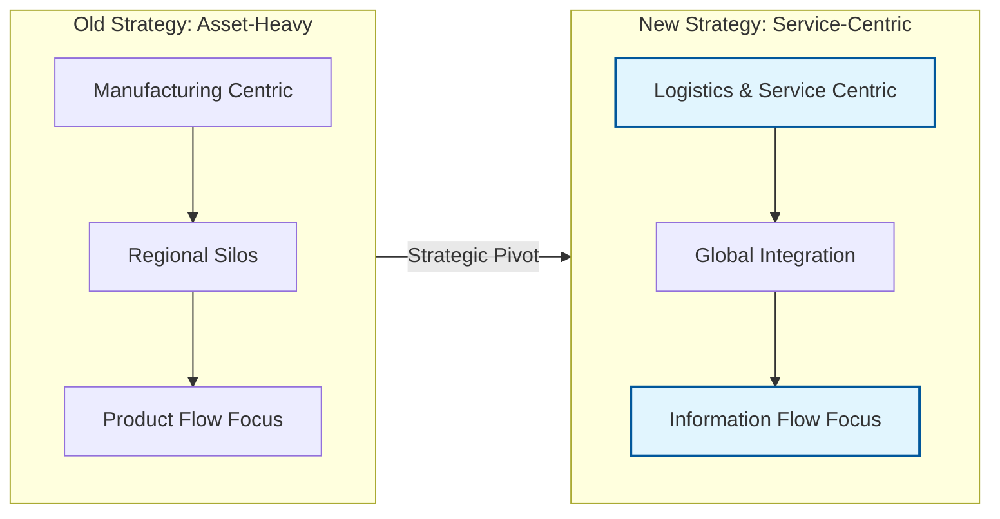
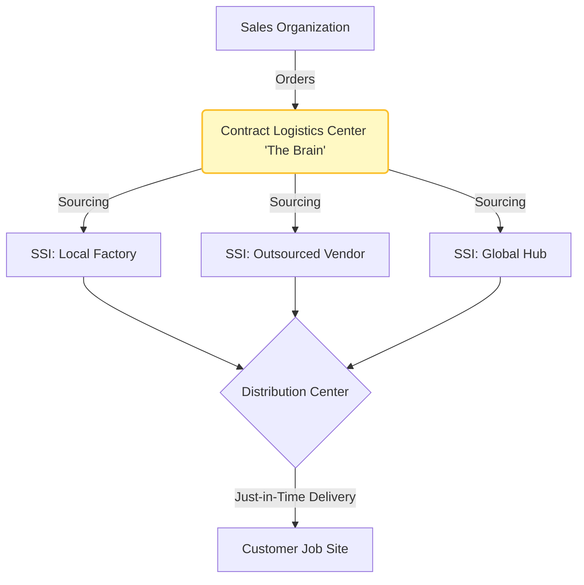
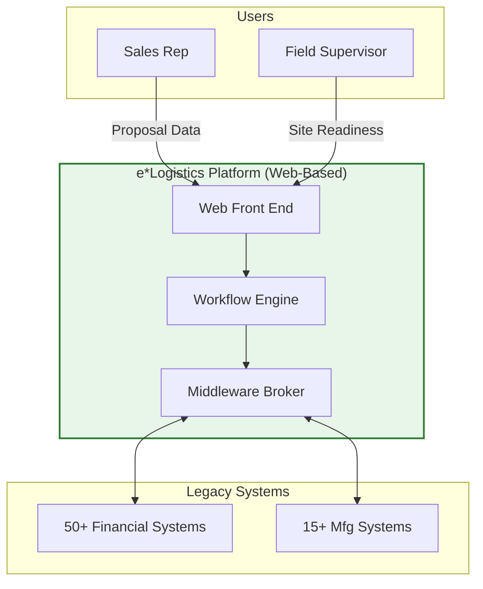
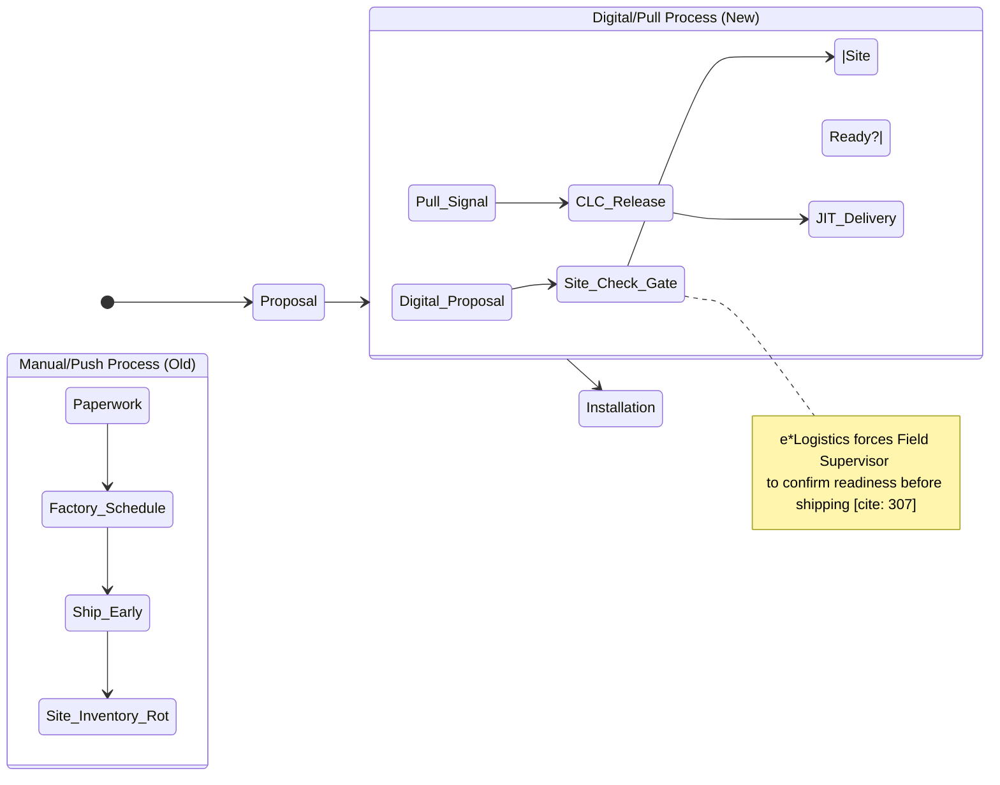
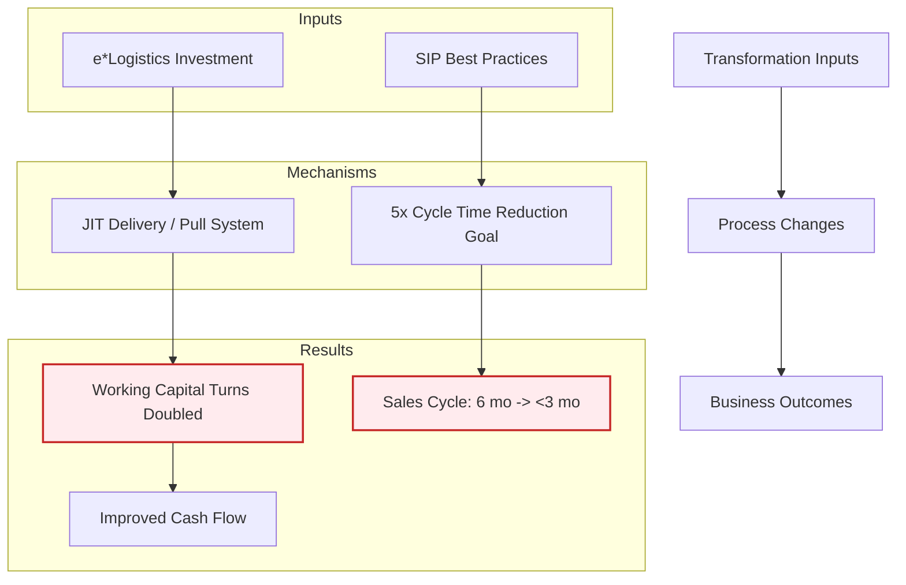

### **Q1: Strategic Alignment & Business Transformation**

Question:

Otis President Ari Bousbib declared, "We are no longer making things; we are moving things"1. Analyze this strategic pivot from a <mark style="background: #FFB8EBA6;">manufacturing-centric</mark> to a <mark style="background: #FFB8EBA6;">service-and-logistics-centric</mark> model. How did the e*Logistics program serve as the "strategic alignment" bridge between this new vision and operational reality? Use the Strategic Alignment Model (Business Strategy $\leftrightarrow$ IT Strategy) to frame your answer.

Solution:

The transformation at Otis represents a classic shift in strategic scope, requiring a tight coupling between business goals and IT architecture.

- **The Strategic Shift:**
    
    - **Old Strategy:** <mark style="background: #FFB8EBA6;">A decentralized, product-focused industrial firm where manufacturing was the core competency</mark>2222.
        
    - **New Strategy:** <mark style="background: #FFB8EBA6;">A "customer-centric" service and logistics company</mark>3. <mark style="background: #FFB8EBA6;">The goal was to differentiate via "orders-of-magnitude improvements in logistics and service" rather than just hardware manufacturing</mark>4.
        
- **The IT Bridge (e*Logistics):**
    
    - **Enabler of Vision:** The <mark style="background: #FFB8EBA6;">e*Logistics program was not just a back-office upgrade; it was the "critical enabler" of the information transformation</mark>5. It facilitated the shift from managing physical assets to managing information flows6.
        
    - **Process Integration:**<mark style="background: #FFB8EBA6;"> The system connected disparate functions (sales, factory, field) through the Web, replacing manual hand-offs with automated workflows</mark>7777. <mark style="background: #FFB8EBA6;">This aligns with the strategic goal of acting as a single, integrated company rather than a collection of regional entities.</mark>
        
    - **Standardization:** To support the global strategy, <mark style="background: #FFB8EBA6;">IT forced standardization. For example, the **SIP (Sales and Installation Process)** best practices were "baked into" the organization via the e*Logistics software, ensuring that the strategic process changes were institutionalized and sustainable</mark>888.
        
- **Long-Term Impact:** <mark style="background: #FFB8EBA6;">By aligning IT with the "service excellence" strategy, Otis aimed to reduce cycle times by 5x</mark>99, fundamentally altering its competitive responsiveness.
    

---

### **Q2: Business Process Reengineering (BPR) & Change Management**

Question:

The case mentions that "virtually everyone in the company would come in contact with the eLogistics program"10. Using <mark style="background: #FFB8EBA6;">Lewin’s Change Management Model (Unfreeze-Change-Refreeze)</mark>, evaluate the implementation of the eLogistics program. How did Otis use IT to "refreeze" new behaviors in a workforce traditionally resistant to change?

Solution:

Otis faced significant cultural inertia, as <mark style="background: #FFB8EBA6;">field supervisors were often "firefighters" rather than business managers</mark>11. The implementation followed a BPR approach supported by IT:

- **Unfreeze (Preparing for Change):**
    
    - <mark style="background: #FFB8EBA6;">Otis recognized that reliance on manual processes and disjointed legacy systems caused inefficiencies (e.g., 65 million hours of labor annually)</mark>12.
        
    - Bousbib set a <mark style="background: #FFB8EBA6;">"Big Hairy Audacious Goal" (BHAG) to reduce the order-to-hand-over cycle by fivefold</mark>, creating urgency for change13.
        
- **Change (The Transition):**
    
    - **Process Redesign:** <mark style="background: #FFB8EBA6;">Otis moved from a "push" system (shipping products when made) to a "pull" system (shipping based on site readiness)</mark>14.
        
    - **Role Evolution:** <mark style="background: #FFB8EBA6;">Field supervisors were required to use laptops to check site progress and approve orders, forcing them to adopt new digital behaviors</mark>151515.
        
- **Refreeze (Sustaining Change via IT):**
    
    - **Hard-Coded Best Practices:** The e*Logistics system prevented deviation from the new process. For instance, orders _could not_ be released to the factory until a supervisor formally assessed the job site16.
        
    - **Automated Accountability:** The system sent timed e-mail reminders, forcing critical steps of the SIP to occur17. As Project Director Di Francesco noted, while employees might revert to old habits after a manual change program, e*Logistics ensured the changes "stuck" by embedding them into the daily workflow18181818.
        

---

### **Q3: Supply Chain Optimization & Networked Organizations**

Question:

<mark style="background: #FFB8EBA6;">Otis transitioned its supply chain from local manufacturing to a global network of Contract Logistics Centers (CLCs) </mark>and Subsystem Integrators (SSIs). How does this structure illustrate the concept of a Virtual or Networked Organization? Discuss the role of information transparency in this new supply chain model.

Solution:

Otis moved away from vertical integration ("we never need to make anything ourselves" 19) toward a networked ecosystem orchestrated by data.

- **The Networked Structure:**
    
    - <mark style="background: #FFB8EBA6;">**Decoupling Production:** The CLCs did no manufacturing; they acted as the "brain," managing logistics, customer needs, and configuring units</mark>20.
        
    - <mark style="background: #FFB8EBA6;">**Global Sourcing:** SSIs (Subsystem Integrators) could be Otis entities or third-party providers, selected based on lowest cost and best quality</mark>21. This flexibility allowed CLCs to source components from anywhere in the world22.
        
- **Information as the Glue:**
    
    - **Transparency:** The new model required "orders-of-magnitude improvements in logistics"23. Network technologies allowed CLCs to see orders across the entire supply chain24.
        
    - <mark style="background: #FFB8EBA6;">**Just-in-Time (JIT) Execution</mark>:** The system enabled a JIT model where materials were delivered exactly when the job site was ready, reducing inventory and waste25252525.
        
    - **Cycle Time Reduction:** By digitizing the flow between sales, CLCs, and SSIs, Otis aimed to reduce the "Order Fulfillment" cycle time by 5x26.
        

---

### **Q4: Competitive Advantage & The Resource-Based View (RBV)**

Question:

Otis had previously<mark style="background: #FFB8EBA6;"> revolutionized service with OTISLINE in the 1980s</mark>27. With e*Logistics, they attempted a "second revolution." Applying the Resource-Based View (RBV) of the firm, analyze whether the e*Logistics system provides a sustainable competitive advantage. Is this system a<mark style="background: #FFB8EBA6;"> VRIO (Valuable, Rare, Inimitable, Organized) resource</mark>?

**Solution:**

- <mark style="background: #FFB8EBA6;">**Valuable:** Yes. The system directly impacted the bottom line by improving cash flow (working capital turns doubled</mark>) 28and <mark style="background: #FFB8EBA6;">reducing sales cycle times significantly (e.g., from 6 months to less than 3 in the UK)</mark>29.
    
- **Rare:** Yes, at the time. While competitors like Kone were growing 30, Otis was unique in its scale (1.5 million elevators) 31and its attempt <mark style="background: #FFB8EBA6;">to integrate the _entire_ value chain—from proposal to field installation—into a single digital workflow</mark>32.
    
- **Inimitable (Hard to Copy):** High.
    
    - **Proprietary Nature:** <mark style="background: #FFB8EBA6;">The technology was proprietary, built by Otis resources, and customized (e.g., their own version of RosettaNet)</mark>333333.
        
    - **Path Dependence:** <mark style="background: #FFB8EBA6;">The system was built upon decades of accumulated knowledge (SIP, ACE, OTISLINE)</mark>34343434. A competitor could buy similar software but could not easily replicate the _process maturity_ and _data integration_ Otis achieved over years.
        
- **Organized:** <mark style="background: #FFB8EBA6;">Yes. The company reorganized its entire structure around this system (creating CLCs, centralized engineering)</mark>35353535, ensuring they could fully exploit the technology.
    
- **Conclusion:** e*Logistics serves as a sustainable advantage not just because of the software code, but because it institutionalized a complex, cross-functional service culture that is difficult for competitors to copy quickly.
    

---

### **Q5: IT Implementation Risks & Global Standardization vs. Local Agility**

Question:

CIO Ron Beaver noted that Otis operated with "50 financial systems and 15 different manufacturing systems" across the globe36. Discuss the Risk Management strategies Otis employed to roll out e*Logistics in such a fragmented environment. How did they balance the need for global standardization with local technical limitations?

Solution:

<mark style="background: #FFB8EBA6;">Otis faced the classic "legacy system" challenge. A "big bang" replacement of all systems was deemed impossible.</mark>

- **Risk Strategy 1: Middleware & Agnosticism:**
    
    - I<mark style="background: #FFB8EBA6;">nstead of waiting for a single global ERP, they built e*Logistics to be "ERP-agnostic</mark>"37.
        
    - <mark style="background: #FFB8EBA6;">They used a middleware broker to translate data between the modern Web-based e*Logistics layer and the various legacy back-end systems</mark>38. This reduced the risk of operational paralysis during the transition.
        
- **Risk Strategy 2: Simulation & Testing:**
    
    - To mitigate technical failure across diverse infrastructures (WANs/LANs), Otis used emerging technology to <mark style="background: #FFB8EBA6;">_simulate_ application performance in different countries (e.g., China, Russia) before rollout</mark>39393939.
        
- **Risk Strategy 3: Phased Rollout:**
    
    - <mark style="background: #FFB8EBA6;">They avoided a simultaneous global launch. They used pilots (Netherlands, France, Germany, UK) to learn lessons—specifically that it took ~6 months for benefits to materialize</mark>40404040.
        
    - <mark style="background: #FFB8EBA6;">Regions were prioritized based on need and ROI</mark>41.
        
- **Risk Strategy 4: Addressing Human Capital:**
    
    - <mark style="background: #FFB8EBA6;">Recognizing that only 30% of field supervisors were computer-literate 42, Otis invested heavily in training (one month of technology training)</mark> 43 to prevent user rejection.
        

---

# Visualizing each strategy using a flowchart of sorts

### **1. Strategic Pivot: From "Making" to "Moving"**

**Concept:** This dimension covers the fundamental shift in Otis’s corporate identity and strategic vision. <mark style="background: #FFB8EBA6;">Historically, Otis was viewed as an "old-line industrial company" focused on manufacturing assets</mark>1111. <mark style="background: #FFB8EBA6;">President Ari Bousbib redefined the strategy to focus on "service excellence" and logistics</mark>2222.<mark style="background: #FFB8EBA6;"> The goal shifted from simply selling elevators to managing the entire lifecycle of customer solutions, targeting a "5x improvement" in cycle time</mark>3.

Code snippet

### **2. The Networked Supply Chain Model**

**Concept:** This concept focuses on the physical restructuring of operations. <mark style="background: #FFB8EBA6;">Otis moved away from vertical integration where everything was made in-house</mark>. They established <mark style="background: #FFB8EBA6;">**Contract Logistics Centers (CLCs)**, which act as the "brains" of the supply chain, managing orders and logistics without doing the manufacturing</mark>4444. <mark style="background: #FFB8EBA6;">Manufacturing was decoupled into **Subsystem Integrators (SSIs)**—low-cost providers (internal or external)—while **Distribution Centers (DCs)** handled cross-docking</mark>5555.

Code snippet

### **3. Digital Architecture: The e*Logistics Enabler**

**Concept:** This addresses the technological backbone required to execute the strategy. <mark style="background: #FFB8EBA6;">The **e*Logistics** program was the "critical enabler" that replaced manual hand-offs with a web-based, integrated workflow</mark>6. Since Otis had fragmented legacy systems (50 financial, 15 manufacturing), they did not use a single "big bang" ERP7777. Instead,<mark style="background: #FFB8EBA6;"> they used middleware and proprietary web tools to connect sales, factories, and field operations, making the company "infinitely information enabled</mark>"8.

Code snippet

### **4. Process & Cultural Reengineering (SIP)**

**Concept:** Technology alone fails without process and culture change. This dimension covers the <mark style="background: #FFB8EBA6;">**Sales and Installation Process (SIP)**</mark> and the human element. <mark style="background: #FFB8EBA6;">Otis moved from a "Push" system (ship when built) to a "Pull" system (ship when site is ready)</mark>9. <mark style="background: #FFB8EBA6;">The e*Logistics system enforced discipline by preventing orders from proceeding until specific "gates" were cleared (e.g., site readiness checks), effectively turning field "firefighters" into "business managers"</mark>10101010.

Code snippet

### **5. Value Realization & Outcomes**

**Concept:** This final dimension measures the tangible results of the transformation. It quantifies the success through specific KPIs: <mark style="background: #FFB8EBA6;">cycle time reduction (Order-to-Hand-Over), financial health (working capital turns), and service quality</mark>. The transformation<mark style="background: #FFB8EBA6;"> linked operational discipline directly to financial performance, such as the doubling of working capital turns and significant revenue growth</mark>11111111.

Code snippet

---

The key actors, dates, numbers, and milestones that define the Otis Elevator transformation.

### **I. Key Actors**

- **Ari Bousbib:** President of Otis (appointed 2002) and former COO. He was the visionary behind the shift from a manufacturing company to a service/logistics company111.
    
- **George David:** Chairman and CEO of parent company United Technologies (UTC). As a former Otis President, he launched the original OTISLINE system in the 1980s222.
    
- **Ron Beaver:** Chief Information Officer (CIO) appointed in 2001. He was responsible for the global IT infrastructure and the implementation of e*Logistics3.
    
- **Giuliano Di Francesco:** Project Director for the e*Logistics program (starting 2001). He led the team connecting sales, factory, and field operations via the Web44.
    
- **Tony Black:** Vice President of Quality and Field Operations. He initiated the **Sales and Installation Process (SIP)** to standardize best practices5.
    
- **Tom Saxe:** Vice President of Engineering. He led the **SIMBA** program to reduce product complexity and component count6.
    
- **United Technologies (UTC):** The parent company of Otis Elevator7.
    

---

### **II. Key Dates**

- **1853:** Elisha Graves Otis invents the safety-brake elevator8.
    
- **Early 1980s:** Introduction of **OTISLINE**, a centralized customer service dispatch system9.
    
- **2000:** Ari Bousbib becomes Executive Vice President and COO of Otis10.
    
- **2001:**
    
    - Ron Beaver becomes CIO11.
        
    - Launch of the **e*Logistics** information transformation project12121212.
        
    - Launch of the **SIMBA** program for modular product architecture1313.
        
    - Reorganization of supply management into a single global supply chain function14.
        
- **2002:** Ari Bousbib is elected President of Otis15. He establishes the goal for a fivefold improvement in cycle time16.
    
- **2003:**
    
    - Otis celebrates its 150th anniversary17.
        
    - Successful e*Logistics pilot projects run in the Netherlands, France, Germany, and the U.K.18.
        
- **2005 (Target):** Scheduled full-scale rollout of e*Logistics in Europe and China19.
    
- **2006 (Target):** Scheduled deployment of e*Logistics for the rest of the company20.
    

---

### **III. Key Numbers**

- **Financials (2003):**
    
    - Revenue: **$7.9 billion**21.
        
    - Operating Profit: **$1.38 billion**22.
        
    - Profit Margin: **17.4%**23.
        
- **Scale:**
    
    - **60,000** employees (90% outside the U.S.)24.
        
    - **1.5 million** elevators and **100,000** escalators in operation worldwide25.
        
    - **1.4 million** units under maintenance contracts26.
        
    - Sales in more than **200** countries and territories27.
        
- **Transformation Metrics:**
    
    - **5x:** The target factor for reduction in the order-to-hand-over cycle time28.
        
    - **65 million:** Annual labor hours required to install and maintain products29.
        
    - **300:** Person-years of effort invested in the e*Logistics program30.
        
    - **50:** The number of distinct engineering programs (down from 500) after rationalization31.
        
    - **<3 months:** The reduced sales cycle time in the U.K. pilot (down from >6 months)32.
        

---

### **IV. Key Milestones**

- **OTISLINE Implementation:** A 24x7 centralized dispatch center that centralized service views and improved response times, marking the first wave of IT transformation33.
    
- **REM (Remote Elevator Monitoring):** The deployment of microprocessor-based monitoring that allowed elevators to log performance statistics and communicate problems directly to headquarters34.
    
- **The "5x" BHAG (Big Hairy Audacious Goal):** In 2002, Bousbib set a goal to reduce the order-to-hand-over cycle time by five times within five years35.
    
- **Creation of CLCs:** The establishment of **Contract Logistics Centers**, shifting the company's center of gravity from manufacturing to logistics and information management36.
    
- **SIMBA Program:** A radical simplification of engineering to create a standard, modular architecture, reducing inventory (e.g., from 72 motor types to 10)37373737.
    
- **SIP (Sales and Installation Process):** The standardization of field operations best practices (e.g., pre-bid checklists) to reduce labor inefficiencies38383838.
    
- **Gen2 Elevator:** The introduction of a flat-belt elevator system that eliminated the need for a machine room, described as the fastest-selling new product in Otis history39393939.