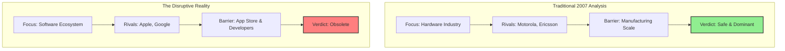
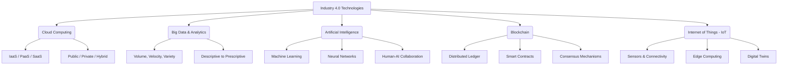
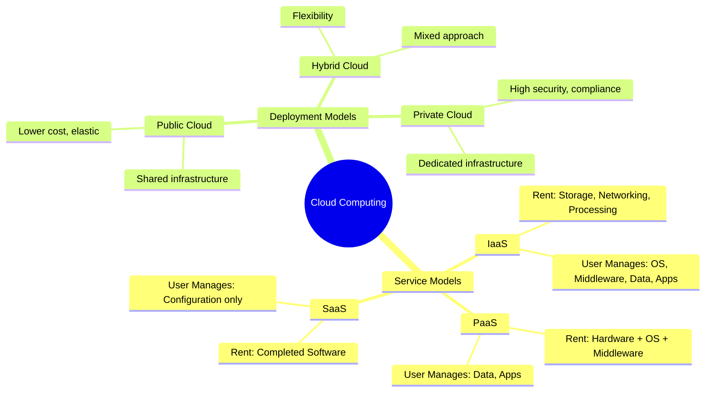
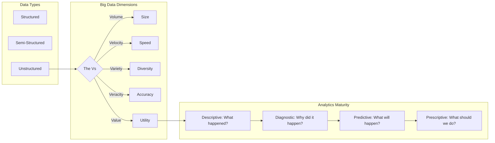
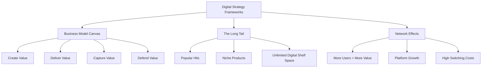
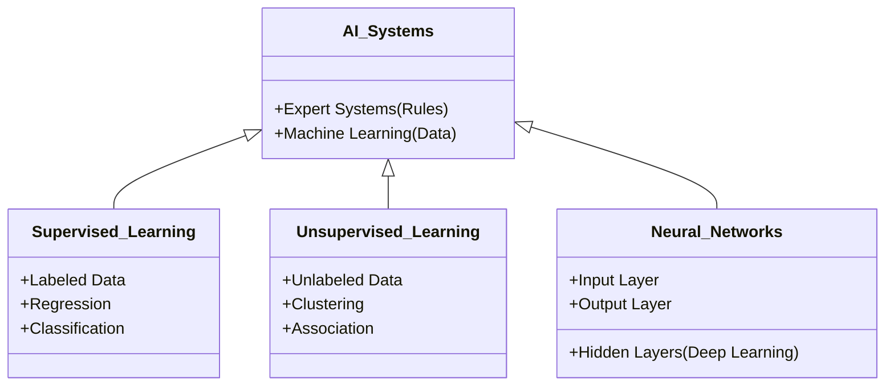

Cloud Service Models -> SaaS, PaaS, IaaS, Traditional On Prem
Cloud Deployment Models -> Public Cloud, Private Cloud, Hybrid Cloud

---

**Q1: How can a traditional "brick-and-mortar" business effectively transition to a digital business model using the "Business Model Canvas" framework elements described in the case?**

- **Context:** The slides discuss the downfall of Blockbuster and the rise of Netflix, highlighting the importance of business model adaptation1111.
    
- <mark style="background: #FFB8EBA6;">**Framework:** Business Model Canvas (Create, Deliver, Capture, Defend Value)</mark>22222.
    
- **Solution:**
    
    - <mark style="background: #FFB8EBA6;">**Create Value:** Shift from product-centric (renting physical DVDs) to customer-centric (offering convenience, personalized entertainment, and "no late fees")</mark>33. Use data analytics to understand customer preferences (e.g., Netflix's Cinematch)4444.
        
    - <mark style="background: #FFB8EBA6;">**Deliver Value:** Move from physical distribution channels (stores) to digital/logistics channels (mail delivery, then streaming). This reduces overhead costs and expands reach beyond local geography</mark>5555.
        
    - <mark style="background: #FFB8EBA6;">**Capture Value:** Transition from transaction-based revenue (pay-per-rental + late fees) to recurring revenue models (subscription services). This ensures predictable cash flow and loyalty</mark>6666.
        
    - <mark style="background: #FFB8EBA6;">**Defend Value:** Build barriers to entry through **Network Effects** (platform growth), proprietary technology (recommendation algorithms), and high **Switching Costs** (customer data profiles and personalization history)</mark>777777777777777.
        

**Q2: Analyze the strategic importance of "The Long Tail" phenomenon for digital platforms compared to traditional retail.**

- **Context:** The slides illustrate "The Long Tail" concept using Amazon, Netflix, and Rhapsody compared to traditional retailers like Wal-Mart and Blockbuster 8.
    
- **Framework:** The Long Tail (Chris Anderson)9.
    
- **Solution:**
    
    - **Concept:** <mark style="background: #FFB8EBA6;">Traditional retailers are limited by shelf space and must focus on "hits" (high-volume products). Digital businesses have virtually unlimited shelf space</mark>10.
        
    - **Application:** <mark style="background: #FFB8EBA6;">Digital platforms can profitably offer a vast volume of niche/less popular products (the "tail") that traditional stores cannot stock. </mark><mark style="background: #FFB8EBA6;">Aggregating low-volume sales across many niche items can rival or exceed the sales of "hits"</mark>11111111.
        
    - **Strategic Advantage:** This creates a competitive advantage by satisfying diverse customer tastes and increasing customer retention, as users can find obscure content unavailable elsewhere12.
        

**Q3: Evaluated through Porter's Five Forces, why did Nokia fail to predict its downfall, and how does the "Blue Ocean Strategy" offer a counter-perspective?**

- **Context:** The slides present a 5-Force analysis of Nokia circa 2007 which failed to predict its decline 13.
    
- **Framework:** Porter's Five Forces vs. Innovation/Blue Ocean Thinking.
    
- **Solution:**
    
    - **Failure of Traditional Analysis:** Nokia likely focused on existing competitors (Motorola, Ericsson) and traditional threats. They underestimated the **Threat of Substitutes** from a new _type_ of device (smartphones as pocket computers) and the **Power of Buyers** shifting towards software/app ecosystems14141414.
        
    - **Missing Factor:** The slides suggest Nokia failed because they focused on the hardware ("reason people buy mobile phones") rather than the ecosystem/platform value15.
        
    - **Strategic Pivot:** A "Blue Ocean" approach would have looked beyond the existing industry boundaries (feature phones) to create a new market space (smartphones with app stores) that made the competition irrelevant.

The case of Nokia is used to illustrate the limitations of traditional strategic frameworks like **Porter’s Five Forces** when an industry undergoes a fundamental paradigm shift (disruption)1.

In 2007, a standard Five Forces analysis would have likely concluded that Nokia's position was secure and profitable. However, the analysis failed to predict Nokia's rapid downfall because it focused on the existing "mobile phone" hardware industry rather than the emerging "mobile computing" software ecosystem.

### **The "Traditional" 2007 Analysis vs. The Reality**

Here is an expansion on how each force was likely perceived versus what actually happened:

#### **1. Threat of Substitutes**

- **The 2007 View:** **Low.** There were no direct substitutes for a mobile phone. Landlines were dying, and PDAs were niche. Nokia dominated the "phone" market2.
    
- **The Reality (The Miss):** **High.** The iPhone (introduced in 2007) and later Android devices were not just "better phones"—they were substitutes for the entire concept of a functional phone. They were pocket computers. The "reason people buy mobile phones" shifted from calling/texting to internet/apps3. Nokia failed to see that a "smart device" was a substitute for a "feature phone."
    

#### **2. Barriers to Entry**

- **The 2007 View:** **High.** Nokia had massive economies of scale, superior supply chain management, and established carrier relationships. It was incredibly expensive for a new hardware player to enter and compete on price/volume4.
    
- **The Reality (The Miss):** **Low (for Tech Giants).** Apple and Google entered not by competing on _hardware manufacturing_ (where Nokia was strong) but by leveraging _software platforms_. The barrier to entry shifted from "making hardware" to "building an ecosystem." Nokia's hardware scale became a liability (inflexibility) rather than an asset.
    

#### **3. Competitive Rivalry**

- **The 2007 View:** **Moderate/High (but winning).** Nokia was winning the hardware war against traditional rivals like Motorola, Sony Ericsson, and Samsung. They had the widest range of devices5.
    
- **The Reality (The Miss):** **Disrupted.** The competition shifted away from hardware specs (battery life, durability) to software capability and user experience (UX). Nokia was fighting a hardware battle while Apple and Google were fighting a platform war.
    

#### **4. Power of Buyers**

- **The 2007 View:** **Mixed.** Individual buyers loved the Nokia brand (loyalty). Carriers held some power, but needed Nokia's popular devices to sell contracts6.
    
- **The Reality (The Miss):** **High.** Customer loyalty proved fragile. Once the value proposition shifted to "apps" and "touchscreens," the **switching costs** (which the slides identify as a powerful resource 7) worked against Nokia. Users who moved to iOS/Android locked themselves into those ecosystems via data and app purchases, making it impossible for Nokia to win them back.
    

#### **5. Power of Suppliers**

- **The 2007 View:** **Low.** Nokia was the 800-pound gorilla. They could dictate terms to component suppliers (screens, chips, batteries) due to their massive volume8.
    
- **The Reality (The Miss):** **Shifted.** The definition of "supplier" changed. In the new ecosystem model, **App Developers** became the critical suppliers of value. Nokia's Symbian OS was difficult to develop for, while iOS and Android were developer-friendly. Nokia lost the power over these new "content suppliers."
    

### **Summary of the Strategic Failure**

The slides suggest that Nokia's failure wasn't just operational, but a failure to understand their **Business Model** in a changing world 9.

- **Value Creation:** They continued creating durable hardware when users wanted smart software.
    
- **Value Capture:** They relied on selling units (hardware) while competitors captured value through app stores and data.
    
- **Value Defense:** They tried to defend using economies of scale (hardware barrier) instead of network effects (ecosystem barrier)10.
    

### **Visual Comparison**

Code snippet

        

**Q4: How does the integration of "Human-in-the-Loop" (HITL) architecture mitigate risks in AI deployment for high-stakes industries?**

- **Context:** The slides discuss AI collaboration models (HITL, HOTL, HOOTL) and the need for explainable AI16161616.
    
- **Framework:** Human-AI Collaboration Models 17.
    
- **Solution:**
    
    - **Risk Mitigation:** In high-stakes fields (Healthcare, Public Safety), AI errors can be fatal (e.g., misdiagnosing a "wolf" vs. "husky" in image recognition implies potential for serious error in other contexts)18181818.
        
    - **HITL Role:** A human expert verifies AI suggestions before action is taken. This combines AI's speed/scale with human judgment/ethics19191919.
        
    - **Explainability:** "Explainable AI" is crucial here. The AI must provide rationale ("Why did you do that?") so the human can trust and validate the decision, ensuring accountability20202020.
        
The following expansion covers the three primary AI collaboration models—**HITL**, **HOTL**, and **HOOTL**—and details why **Explainable AI (XAI)** is the non-negotiable "glue" that makes these models safe and effective.

### **1. AI Collaboration Models: The Spectrum of Control**

The distinction between these models lies in the _timing_ and _necessity_ of human intervention. It is not just about "who does the work," but who holds the ultimate accountability.

#### **A. Human-in-the-Loop (HITL)**

- **Definition:** The AI system acts as a subordinate or assistant. It cannot execute a final decision without explicit human approval. The "loop" is broken until a human bridges the gap between suggestion and action.
    
- **Mechanism:**
    
    1. AI analyzes data and offers a recommendation or a set of options (e.g., "70% probability of pneumonia").
        
    2. A human expert reviews the raw data (X-ray) alongside the AI's output.
        
    3. The human makes the final judgment.
        
- **Best For:** High-stakes environments where the cost of error is unacceptable (e.g., medical diagnoses, judicial sentencing, nuclear plant operations).
    
- **Key Challenge:** **Bottlenecking.** The system moves only as fast as the human operator, which negates the speed advantage of AI.
    

#### **B. Human-on-the-Loop (HOTL)**

- **Definition:** The AI is autonomous but supervised. It executes decisions on its own, but a human monitor actively watches the system in real-time and can intervene (hit the "stop" button) if the AI deviates from expected behavior.
    
- **Mechanism:**
    
    1. AI executes tasks continuously (e.g., an autonomous assembly line robot).
        
    2. Human supervisors monitor dashboards or exception logs.
        
    3. Intervention occurs _only_ when the system flags an anomaly or behaves erratically.
        
- **Best For:** Time-sensitive tasks where human reaction time is too slow to control every step, but oversight is legally or ethically required (e.g., self-driving cars, high-frequency trading algorithms, air traffic control support).
    
- **Key Challenge:** **Automation Complacency.** Operators may become too trusting or bored, reacting too slowly when a critical failure finally happens because they are "out of practice".
    

#### **C. Human-out-of-the-Loop (HOOTL)**

- **Definition:** The system operates with full autonomy. It gathers data, makes decisions, and executes actions without human intervention. Humans set the initial goals and parameters but are removed from the operational process.
    
- **Mechanism:** The algorithm is a "black box" that runs independently. Feedback loops (if any) are automated.
    
- **Best For:** Low-stakes, high-volume tasks where individual errors are tolerable or easily reversible (e.g., Netflix recommendation engines, spam filters, dynamic pricing in retail).
    
- **Key Challenge:** **Runaway Feedback Loops.** If the system learns a bias or error, it scales that error infinitely without anyone noticing until it causes systemic damage (e.g., a flash crash in stock markets).
    

---

### **2. The Critical Need for Explainable AI (XAI)**

As we move from HITL to HOOTL, the risk of "Black Box" decision-making increases. **Explainable AI (XAI)** is the set of tools and techniques used to open that black box, translating complex algorithmic decisions into language humans can understand.

Without XAI, collaboration models fail for three specific reasons:

#### **A. The Trust Gap (For HITL)**

In a HITL scenario, if an AI suggests a treatment plan that contradicts a doctor's training, the doctor will ignore it unless the AI can explain _why_.

- **Without XAI:** "Prediction: Cancer." (Doctor rejects it as a glitch).
    
- **With XAI:** "Prediction: Cancer. Reason: Irregular density detected in upper quadrant, consistent with historic malignant cases." (Doctor investigates and verifies).
    

#### **B. The "Moral Crumple Zone" (For HOTL)**

In HOTL systems, humans are often blamed when the autonomous system crashes (e.g., self-driving car accidents). This is called the "Moral Crumple Zone"—the human takes the impact for a machine's failure.

- **Role of XAI:** It acts as a "black box recorder," allowing investigators to see if the AI misidentified a truck as a cloud (a perception error) or decided to hit the truck to avoid a pedestrian (a logic decision). This distinguishes between system failure and human supervisory failure.
    

#### **C. Debugging and Bias Detection (For HOOTL)**

Fully autonomous systems can develop "hidden biases" that are invisible in the output but rot the system from the inside.

- **Example:** An HR hiring bot might stop rejecting women explicitly but start rejecting resumes with the word "softball" (a proxy for women).
    
- **Role of XAI:** Explainability tools (like LIME or SHAP values) highlight _which features_ heavily influenced the decision, revealing that "softball" was a negative weight, thus exposing the bias for correction.
    

### **Summary Table: Risk & Requirement**

| **Model** | **Human Role**     | **Primary Risk**      | **Why Explainable AI is Needed**                                                 |
| --------- | ------------------ | --------------------- | -------------------------------------------------------------------------------- |
| **HITL**  | **Decision Maker** | Bottlenecks / Fatigue | To provide rationale so the human can make an _informed_ decision quickly.       |
| **HOTL**  | **Supervisor**     | Complacency           | To allow the human to understand _context_ immediately when an alarm triggers.   |
| **HOOTL** | **Designer**       | Scaled Errors / Bias  | To audit the system _post-hoc_ (after the fact) and prove regulatory compliance. |

---
The provided slides actually list **eight** dimensions of Big Data, often referred to as the "Vs" and other characteristics. While the traditional model usually highlights three or five, the specific framework in your material includes the following 1:

1. **Volume**: Refers to the sheer size of the data being generated and stored (e.g., expanding from terabytes to zettabytes)2222.
    
2. **Velocity**: Refers to the speed at which data is generated, processed, and analyzed (e.g., real-time streaming vs. batch processing)3333.
    
3. **Variety**: Refers to the different types of data available, including structured (tables), semi-structured (XML/JSON), and unstructured (video, audio, text) data4444.
    
4. **Veracity**: Refers to the quality, accuracy, and trustworthiness of the data. The slides note this with a "(-)" sign, possibly indicating the challenge of maintaining accuracy in large datasets5555.
    
5. **Variability**: Refers to the inconsistency or changing nature of data flows and meanings over time (marked with a "(+)" in the slides)6666.
    

**Additional Dimensions Discussed:**

- **Complexity (+):** The difficulty of managing and linking data (e.g., connecting social media interactions to transaction history)7777.
    
- **Value (+):** The potential business utility or insight that can be extracted from the data8888.
    
- **Decay (+):** The concept that data loses value over time; relevance diminishes as data gets older9999.
    

The slides visualize these dimensions interacting, showing how "Volume" and "Velocity" expand while factors like "Complexity" and "Variability" add challenges to extracting "Value"10101010.

---

**Q5: Explain how Blockchain technology acts as a "disintermediation" force in supply chain management.**

- **Context:** The slides define Blockchain's characteristics (decentralization, immutability) and its application in supply chains212121212121212121.
    
- **Framework:** Disintermediation & Distributed Ledger Technology (DLT).
    
- **Solution:**
    
    - **Problem:** Traditional supply chains rely on intermediaries (banks, brokers) to verify transactions and trust, adding cost and time22.
        
    - **Solution:** Blockchain uses a distributed ledger where all parties have a synchronized, immutable copy of data23232323.
        
    - **Impact:**
        
        - **Trust:** Trust is established via code/consensus (e.g., Proof of Work), not a central authority24242424.
            
        - **Efficiency:** Smart contracts automatically enforce rules, removing manual paperwork and middlemen25252525.
            
        - **Transparency:** All participants can track goods from origin to destination, reducing fraud26.
            

---

### **Part 2: 5 MECE Concepts Breakdown**

Below is a breakdown of the case materials into 5 Mutually Exclusive, Collectively Exhaustive (MECE) concepts.

#### **Concept 1: Core Technologies of Industry 4.0**

This concept groups the foundational technologies driving the current industrial revolution described in the slides 27272727.

Code snippet

#### **Concept 2: Cloud Computing Service & Deployment Models**

This defines _how_ computing services are delivered and _where_ they are hosted, separating the service types from the deployment methods 28282828.

Code snippet

#### **Concept 3: The Data Value Chain (Big Data & Analytics)**

This traces the lifecycle of data from raw input to actionable wisdom, covering data types and the hierarchy of analytics 29292929.

Code snippet

#### **Concept 4: Digital Business Strategy & Transformation**

This focuses on the strategic frameworks used to build and analyze digital businesses, such as Netflix303030303030303030.

Code snippet

#### **Concept 5: Artificial Intelligence & Machine Learning Architectures**

This breaks down the specific methodologies within AI, distinguishing between learning types and network structures31313131313131313131313131313131.

Code snippet

